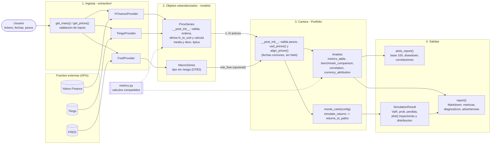

# Arquitectura

```mermaid
flowchart LR
    U(["Usuario<br/>tickers, fechas, pesos"])

    subgraph FUENTES["Fuentes externas (APIs)"]
        Y[("Yahoo Finance")]
        T[("Tiingo")]
        F[("FRED")]
    end

    subgraph INGESTA["1. Ingesta - extraction/"]
        V1["get_many() / get_prices()<br/>validacion de inputs"]
        YP["YFinanceProvider"]
        TP["TiingoProvider"]
        FP["FredProvider"]
    end

    subgraph MODELOS["2. Objetos estandarizados - models/"]
        PS["PriceSeries<br/>__post_init__: valida, ordena,<br/>alinea fx_to_usd y calcula<br/>media y desv. tipica"]
        MS["MacroSeries<br/>tipo sin riesgo (DTB3)"]
    end

    subgraph CARTERA["3. Cartera - Portfolio"]
        PI["__post_init__: valida pesos,<br/>usd_prices() y align_prices()<br/>(fechas comunes, sin NaN)"]
        AN["Analisis<br/>metrics_table, benchmark_comparison,<br/>correlation, currency_attribution"]
        MC["monte_carlo(config)<br/>simulate_returns -> returns_to_paths"]
    end

    subgraph SALIDAS["4. Salidas"]
        R["report()<br/>Markdown: metricas,<br/>diagnosticos, advertencias"]
        PR["plots_report()<br/>base 100, drawdown,<br/>correlaciones"]
        SR["SimulationResult<br/>VaR, prob. perdida,<br/>plot() trayectorias y distribucion"]
    end

    U --> V1
    V1 --> YP & TP & FP
    Y --> YP
    T --> TP
    F --> FP
    YP --> PS
    TP --> PS
    FP --> MS
    PS -- "1..N activos" --> PI
    MS -- "risk_free (opcional)" --> PI
    PI --> AN
    PI --> MC
    AN --> R
    AN --> PR
    MC --> SR
    SR --> R

    M[["metrics.py<br/>calculos compartidos"]]
    M -.-> PS
    M -.-> AN
```
