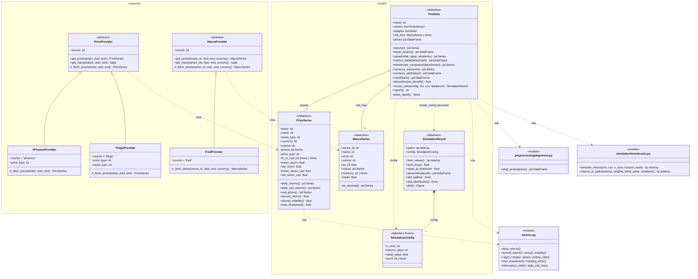

# Modelos (diagrama de clases)

```mermaid
classDiagram
    direction TB

    namespace extraction {
        class PriceProvider {
            <<abstract>>
            +source: str
            +get_prices(ticker, start, end) PriceSeries
            +get_many(tickers, start, end) tuple
            #_fetch_prices(ticker, start, end)* PriceSeries
        }
        class MacroProvider {
            <<abstract>>
            +source: str
            +get_series(series_id, start, end, currency) MacroSeries
            +get_many(series_ids, start, end, currency) tuple
            #_fetch_series(series_id, start, end, currency)* MacroSeries
        }
        class YFinanceProvider {
            +source = "yfinance"
            +price_type: str
            #_fetch_prices(ticker, start, end) PriceSeries
        }
        class TiingoProvider {
            +source = "tiingo"
            +price_type: str
            +asset_type: str
            #_fetch_prices(ticker, start, end) PriceSeries
        }
        class FredProvider {
            +source = "fred"
            #_fetch_series(series_id, start, end, currency) MacroSeries
        }
    }

    namespace models {
        class PriceSeries {
            <<dataclass>>
            +ticker: str
            +name: str
            +asset_type: str
            +currency: str
            +source: str
            +prices: pd.Series
            +price_type: str
            +fx_to_usd: pd.Series | None
            +mean_return: float
            +std_return: float
            +mean_return_usd: float
            +std_return_usd: float
            +daily_returns() pd.Series
            +daily_usd_returns() pd.Series
            +usd_prices() pd.Series
            +annual_return() float
            +annual_volatility() float
            +max_drawdown() float
        }
        class MacroSeries {
            <<dataclass>>
            +series_id: str
            +name: str
            +units: str
            +source: str
            +as_of: date
            +values: pd.Series
            +currency: str | None
            +mean: float
            +as_decimal() pd.Series
        }
        class Portfolio {
            <<dataclass>>
            +name: str
            +assets: list~PriceSeries~
            +weights: list~float~
            +risk_free: MacroSeries | None
            +prices: pd.DataFrame
            +returns() pd.Series
            +asset_returns() pd.DataFrame
            +value(initial_value, rebalance) pd.Series
            +metrics_table(benchmark) pd.DataFrame
            +benchmark_comparison(benchmark) pd.Series
            +currency_exposure() pd.Series
            +currency_attribution() pd.DataFrame
            +correlation() pd.DataFrame
            +diversification_benefit() float
            +monte_carlo(config, mu, cov, rebalance) SimulationResult
            +report() str
            +plots_report() None
        }
        class SimulationConfig {
            <<dataclass frozen>>
            +n_sims: int
            +horizon_days: int
            +initial_value: float
            +seed: int | None
        }
        class SimulationResult {
            <<dataclass>>
            +paths: np.ndarray
            +config: SimulationConfig
            +final_values() np.ndarray
            +prob_loss() float
            +value_at_risk(level) float
            +percentiles(levels) pd.DataFrame
            +plot_paths() Axes
            +plot_distribution() Axes
            +plot() Figure
        }
    }

    class metrics_py["metrics.py"] {
        <<module>>
        +daily_returns()
        +annual_return() / annual_volatility()
        +cagr() / sharpe_ratio() / sortino_ratio()
        +max_drawdown() / tracking_error()
        +information_ratio() / daily_risk_free()
    }
    class alignment_py["preprocessing/alignment.py"] {
        <<module>>
        +align_prices(prices) pd.DataFrame
    }
    class montecarlo_py["simulation/montecarlo.py"] {
        <<module>>
        +simulate_returns(mu, cov, n_sims, horizon, seed) np.ndarray
        +returns_to_paths(returns, weights, initial_value, rebalance) np.ndarray
    }

    %% Herencia: cada fuente nueva es una subclase; el resto del sistema no cambia
    PriceProvider <|-- YFinanceProvider
    PriceProvider <|-- TiingoProvider
    MacroProvider <|-- FredProvider

    %% Estandarizacion: toda fuente devuelve el mismo objeto interno
    PriceProvider ..> PriceSeries : crea
    MacroProvider ..> MacroSeries : crea

    %% Cartera: agrega activos y, opcionalmente, el tipo sin riesgo
    Portfolio o-- "1..*" PriceSeries : assets
    Portfolio o-- "0..1" MacroSeries : risk_free
    Portfolio ..> SimulationConfig : recibe
    Portfolio ..> SimulationResult : monte_carlo() devuelve
    SimulationResult *-- "1" SimulationConfig : config

    %% Dependencias funcionales (calculos compartidos)
    PriceSeries ..> metrics_py : usa
    Portfolio ..> metrics_py : usa
    Portfolio ..> alignment_py : usa
    Portfolio ..> montecarlo_py : usa
```
